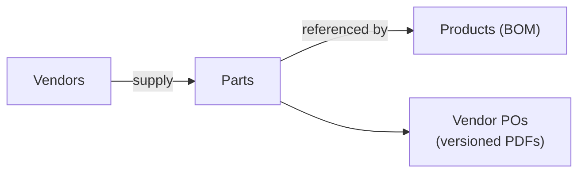

# Statement of Work (SOW)

## Vendor Purchase Order Management System

| Field | Detail |
|-------|--------|
| **Project** | PO Management (`po-mgmt`) |
| **Version** | 1.0 |
| **Date** | 1 July 2026 |
| **Status** | In development |

---

## 1. Executive Summary

This project delivers a web-based **Vendor Purchase Order Management System** for manufacturing operations. The system centralizes master data for vendors, parts, and products (with Bills of Materials), and enables procurement teams to create, version, and export vendor purchase orders as PDFs.

The platform supports two procurement workflows:

1. **Manual PO creation** — select a vendor, add part lines with quantities, and generate a versioned PDF.
2. **BOM-driven PO generation** — define a build plan (products × build quantities), aggregate part demand across BOMs, resolve vendor assignments and pricing, and generate one PO per vendor.

---

## 2. Business Requirements and Needs

### 2.1 Business Context

Manufacturing teams currently manage product BOMs in spreadsheets and create vendor purchase orders manually. This leads to:

- **Data fragmentation** — vendor, part, and product information lives in disconnected Excel files.
- **Manual PO assembly** — procurement staff must manually calculate quantities when building multiple products.
- **No audit trail** — changes to purchase orders are not versioned or easily traceable.
- **Inconsistent part catalog** — duplicate or inconsistently named parts across product lines.

The system addresses these needs by providing a single source of truth for master data, automated demand aggregation from BOMs, vendor-scoped part pricing, and immutable versioned PO PDFs.

### 2.2 Business Objectives

| # | Objective | Success Metric |
|---|-----------|----------------|
| BO-1 | Centralize vendor, part, and product master data | All catalog data manageable in one application |
| BO-2 | Reduce time to create vendor POs | PO creation in minutes vs. manual spreadsheet work |
| BO-3 | Enable bulk PO generation from production build plans | One action produces POs grouped by vendor |
| BO-4 | Maintain PO change history | Every material change creates a new downloadable PDF version |
| BO-5 | Support bulk catalog onboarding | Excel BOM import creates products, parts, and BOM lines in one step |

### 2.3 Scope

**In scope**

- Vendor, part, and product CRUD
- Structured part specifications by category (LED driver, PCB, fastener, etc.)
- Excel BOM import with embedded image extraction
- Manual product BOM editing
- Vendor–part assignment with per-vendor unit pricing
- Manual vendor PO creation and editing
- BOM-driven build plan PO generation with vendor resolution
- PO versioning with PDF export per version
- Dashboard with entity counts and recent PO activity
- Image storage for parts, products, and BOM line images

### Phase Summary

| Phase | Duration | Deliverables | Target |
|-------|----------|--------------|--------|
| **Phase 1: Foundation** | ~3 weeks | DB schema, app shell, shared UI components, data tables | 19 Jul 2026 |
| **Phase 2: Master Data** | ~4 weeks | Vendors, parts, products, Excel import, vendor-part pricing | 16 Aug 2026 |
| **Phase 3: Vendor POs** | ~2.5 weeks | Manual PO CRUD, versioning, PDF export | 6 Sep 2026 |
| **Phase 4: BOM PO Generation** | ~2 weeks | Build plan UI, demand preview, multi-vendor PO creation | 13 Sep 2026 |
| **Phase 5: Polish & Release** | ~2 weeks | Dashboard, QA, docs, production deployment | 20 Sep 2026 |

---

## 4. Sign-off

By signing below, both parties confirm agreement to the scope, timeline, and deliverables described in this Statement of Work.

| | **Client** | **Service Provider** |
|---|------------|----------------------|
| **Organization** | crestled.com | xorora.com |
| **Name** | Sajjad Khan | |
| **Title** | CEO | |
| **Signature** | | |
| **Date** | | |

---

*Document generated from the `po-mgmt` codebase and project requirements. Last updated: 1 July 2026.*
